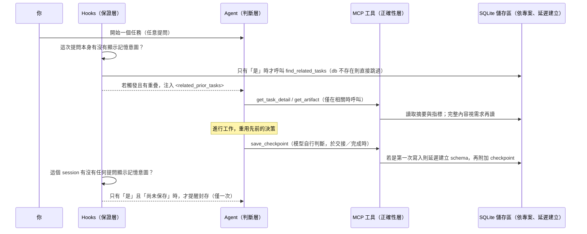

# agent-memory

## 關於此專案

`agent-memory` 為程式碼代理（Claude Code、Codex CLI）提供一個持久化、
**以專案為單位**的**任務記憶**：一個本機 SQLite 儲存區，搭配 MCP 工具、hooks
與一個 skill，讓代理能在任務開始時檢查「這件事我是不是做過？」，並在結束時
留下一份乾淨的交接紀錄——而且不需要仰賴模型「記得要這麼做」。

## 要解決的問題

程式碼代理在不同 session 之間、以及交接給其他代理時，是無狀態的：

- **跨 session 遺失上下文。** 關掉對話、隔天回來，代理完全不知道自己已經試過
  某個做法、踩過某個坑，或做過某個刻意的取捨——只能從零重新推導一次。
- **重新解釋的成本很高。** 唯一的替代方案是把整段先前對話貼回去，這會把
  token 花在試錯與被放棄的嘗試上，而不只是真正值得保留的部分。
- **代理間交接容易漏失資訊。** 當一個代理（或一個 session）把工作交給另一個
  時，決策內容與*背後的原因*、以及尚未完成的事項，除非有人手動寫下來，否則
  很難完整保留下來。
- **「記得要記錄」本身就不可靠。** 如果進度是否被保存，取決於模型有沒有「想
  到」要存，那就不會是一致的行為。

`agent-memory` 的做法是：在每個任務開始時自動查詢這個儲存區，並在結束時給予
一個輕量的提醒去保存——讓「延續性」不必仰賴模型是否記得自己被交代過的規則。

## 核心概念

**三層架構**，各自只負責一件事：

- **判斷層（建議性）** — `skill/agent-memory/SKILL.md` +
  `CLAUDE.md`/`AGENTS.md`。告訴模型*何時*該重用先前的細節、一份 checkpoint
  摘要該包含什麼、以及何時該建立任務之間的關聯。模型可以忽略這一層，忽略了
  也不會壞掉任何東西。
- **正確性層（schema 強制）** — `core/memory.py` + `core/schema.sql`，透過
  `core/mcp_server.py` 以 MCP 工具的形式對外開放。這是*唯一*能寫入記憶的途
  徑。模型自行決定*何時*呼叫這些工具，但永遠無法寫出格式錯誤的紀錄，因為資
  料結構是由程式碼強制規範的，不是靠模型自律。
- **保證層（決定性）** — 由 hooks 呼叫 `core/mem_cli.py`。這個 hook 在*每一
  次*提問時都會執行、檢查該次提問是否顯示記憶意圖，決定是否要做開場查詢——
  這個判斷本身是決定性的關鍵字比對，不是靠模型「想到要問」。提示（prompt）
  只是建議；hook 則一定會執行。

**以專案為單位、延遲建立。** 這裡沒有全域共用的資料庫。儲存區位於相對於當前
工作目錄的 `agent_memory.db`（每個專案各一份），且只有在某個 session 真正呼
叫 `memory_save_checkpoint` 時才會第一次被建立——純讀取的查詢永遠不會建立檔
案，在某個 session 判斷「這裡有值得保留的東西」之前，什麼都不會被寫入任何
地方。每個 MCP 工具也都接受一個可選的 `db_path`，供 session 需要時指定明確
的檔案路徑。

**設計上就精簡 token 用量。** `memory_find_related_tasks` 只回傳輕量欄位
（標題、一行摘要、標籤）——絕不包含 checkpoint 或 artifact 的完整內容。
`memory_get_task_detail` 會多回傳 checkpoints 與 artifact 的*指標*（id +
描述），仍然不含完整內容。只有 `memory_get_artifact`（依 id 呼叫特定一個
artifact）才會把大量內容真正拉進 context。

**用資料列，而非「每個任務一張表」。** 任務、checkpoint、關聯都是固定表格中
的資料列——schema 不會隨任務數量增長。`task_links` 是一張單純的邊表，用於
*穩定*的關係（depends_on / supersedes / derived_from / blocks）；單純的主題
相似度則是查詢時透過 FTS 計算出來的，不會被存成一條邊。

## 觸發流程

實際上會在什麼時候觸發什麼——除非特別註明，這些都是決定性的基礎設施行為，
不是模型自己的主動選擇：

1. **提問顯示記憶意圖 → 才會搜尋，不是每次都搜。** 一個 `UserPromptSubmit`
   hook 會檢查*這一次*提問本身有沒有出現記憶意圖的關鍵字（continue、resume、
   checkpoint、hand off、之前、記得、接續 等）。單純的任務描述（例如「幫我
   加一個健康檢查端點」）不會觸發搜尋；「接續之前的健康檢查端點」才會。沒觸
   發時，這一步完全安靜、什麼都不做，也不會建立任何檔案。觸發時，才會用該
   次提問的文字呼叫 `memory_find_related_tasks`；如果這個專案還沒有任何記憶
   或沒有重疊，一樣安靜地不做事；如果有重疊，就會把一段
   `<related_prior_tasks>` 注入 context。比對方式是把提問拆成多個詞、以「或」
   （OR）的方式去比對標題／摘要，所以即使是一整句自然語言的提問，只要部分
   重疊也能配對成功——不需要提問裡的每個字都出現在某個已存任務中。
2. **任務進行中 → 交給模型自行判斷。** 如果被找出來的任務看起來相關，模型會
   呼叫 `memory_get_task_detail`（只有在真的需要某個特定 artifact 時，才會再
   呼叫 `memory_get_artifact`）來取得更多細節——這一步是建議性的，由判斷層
   引導。
3. **完成／交接 → 由模型決定是否保存。** 依照常駐的協議，當模型判斷這份工作
   值得被記住時，就會呼叫 `memory_save_checkpoint`。這是*唯一*會建立或寫入
   這個儲存區的動作（延遲初始化，第一次使用時才建立）。
4. **保護機制 → 是一個看關鍵字的提醒，不是查詢。** 一個 `Stop` hook 會檢查：
   這個 session 裡有沒有*任何*一次提問表現出想要記憶的意圖（continue、
   resume、checkpoint、hand off、之前、記得、接續 等），*而且*目前還沒有任
   何東西被保存？如果是，就會提醒模型去封存這份工作——每個 session 最多一
   次，且只針對表現出這種意圖的 session。單純「修一個 typo」這種一次性
   session，不會被打擾。



## 怎麼使用

日常使用時，你不需要主動呼叫任何東西——你只要照常工作，上面的觸發流程會在
背後自動運作：

- 想接續先前的工作時，直接在提問裡帶出這個意圖（*continue*、*hand off*、
  *pick up where we left off*、*checkpoint*、*resume*、之前、記得、接續
  等）——如果這個*專案*裡已經有相關的先前工作，就會自動出現在 context 裡。
  單純描述一個新任務，不會觸發這個搜尋，也不需要觸發。
- 照常完成或交接工作。如果這份工作有實質內容，代理應該會自行判斷去封存；如
  果它忘了，而對話又顯示出「之後要接續」的意圖，就會收到一次提醒。
- 上面那些關鍵字同時也會導向 `agent-memory` 這個 skill，裡面有更詳細的工具
  說明。

### 安裝設定

**推薦做法——交給 agent 執行：** 在 Claude Code 或 Codex 中開啟這個資料夾，
然後說

> "set up agent-memory by following SETUP_RUNBOOK.md"

這份 runbook 會讓 agent 蒐集你的路徑資訊、把共用的 `core/` 程式碼與 skill
安裝到全域（但資料庫不會——那會維持以專案為單位、延遲建立），接上 MCP
server 與 hooks，並在每一步驗證結果——在動到任何 config 檔案之前都會先跟你
確認。

**手動安裝：** 見 `INSTALL.md` 裡各工具的詳細步驟。也有 `install.sh` 可以快
速完成核心安裝——它會安裝依賴套件，並把可直接使用的 config 範本產生到
`dist/`（不會寫入固定的 `AGENT_MEMORY_DB`；你得到的仍然是上面描述的、依專案
延遲建立的設計）。

## 資料模型

```
tasks          id, title, summary（滾動式一行摘要）, status, timestamps
checkpoints    task_id, seq, outcome, decisions（json）, open_items（json）
artifacts      checkpoint_id, description, content（內容較大，視需求載入）
task_links     from_task, to_task, relation, note      （僅用於穩定關係）
tasks_fts      標題 + 摘要的 FTS5 索引
```

## 檔案結構

```
core/        schema.sql, memory.py, mcp_server.py, mem_cli.py, requirements.txt
skill/       agent-memory/SKILL.md          （可通用於兩種工具）
claude-code/ .mcp.json, settings.json, CLAUDE.md, hooks/
codex/       config.toml.snippet, AGENTS.md, hooks/
install.sh           一次性、自動處理路徑的安裝腳本（依賴套件 + 產生 config）
SETUP_RUNBOOK.md     可由 agent 直接執行的安裝指南（推薦）
INSTALL.md           手動、依工具區分的安裝步驟
```

## 需求環境

Python 3.10+、`pip install -r core/requirements.txt`（mcp、pydantic），以及
Claude Code 和／或 Codex CLI。

## 授權條款

MIT — 詳見 `LICENSE`（請填入你的姓名／年份）。
