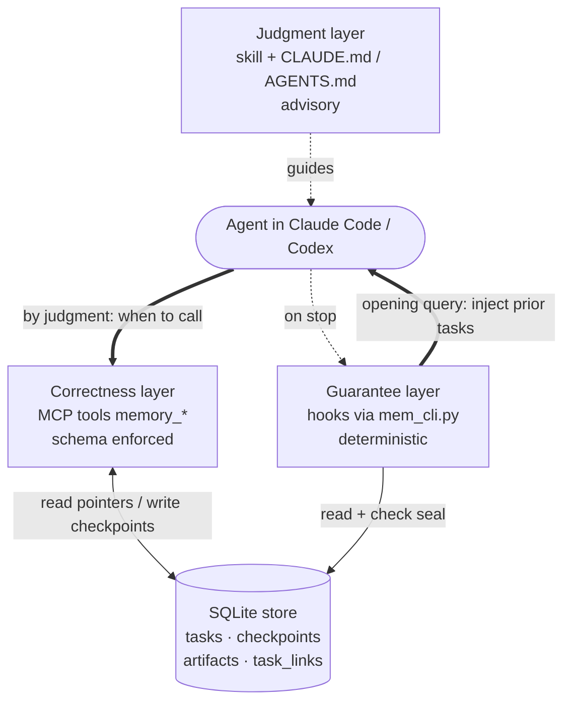

# agent-memory

Cross-session / multi-agent **task memory** for Claude Code and Codex CLI. It
stores task summaries and pointers in a local SQLite file and loads detail only
on demand, so agents reuse prior work and hand off cleanly instead of re-sending
whole histories.

- **Reuse:** before a task, the model is shown relevant past tasks.
- **Handoff:** when one agent finishes or hands off, it seals a checkpoint the
  next agent can pick up.
- **Token-lean:** summaries + pointers by default; heavy content is loaded only
  when a specific item is needed.

Works in **both** Claude Code and Codex — the MCP server and the skill are
identical across them; only the hook/config wiring differs.

## Quick start

```bash
git clone https://github.com/<you>/agent-memory.git
cd agent-memory
./install.sh                 # installs deps, inits the DB, writes ready configs to dist/
```

`install.sh` resolves all absolute paths automatically (no manual editing), then
prints the exact next steps for whichever CLI you use. Add `--copy-skill` to drop
the skill into your user skills dir.

**Or let an agent do it:** open this folder in Claude Code / Codex and say
> "set up agent-memory by following SETUP_RUNBOOK.md"

The runbook makes the agent gather your paths, wire it in, and verify — pausing
for your confirmation before it touches any config.

## How it works (three layers)

- **Judgment** — `skill/agent-memory/SKILL.md` + `CLAUDE.md`/`AGENTS.md`. When to
  use which memory tool, and what to keep in a summary. Advisory.
- **Correctness** — `core/memory.py` + `core/schema.sql`, exposed as MCP tools by
  `core/mcp_server.py`. The only memory actions; schema enforced in code, so the
  model chooses *when*, never *how it's stored*.
- **Guarantee** — hooks calling `core/mem_cli.py`. The opening query and the
  handoff seal run from hooks, not from the model remembering. A prompt is a
  suggestion; a hook is deterministic. (Deterministic on Claude Code; on Codex
  verify hook event names first — see INSTALL.md.)

## Architecture



Task lifecycle:

```mermaid
sequenceDiagram
    participant U as You
    participant Hk as Hooks (guarantee)
    participant Ag as Agent (judgment)
    participant Mc as MCP tools (correctness)
    participant DB as SQLite store

    U->>Ag: start a task
    Hk->>DB: find related prior tasks
    Hk-->>Ag: inject related-prior-tasks block
    Ag->>Mc: get_task_detail / get_artifact (only if relevant)
    Mc->>DB: read summary + pointers; bodies on demand
    Note over Ag: do the work, reuse prior decisions
    Ag->>Mc: save_checkpoint (on handoff / end)
    Mc->>DB: append checkpoint + artifacts
    Hk->>DB: any checkpoint this session?
    Hk-->>Ag: if none, remind to seal
```

## Data model

Tasks, checkpoints, links are **rows** in fixed tables — never one-table-per-task.
Heavy `artifacts.content` is never read except via an explicit `memory_get_artifact`
call. `task_links` is an edge table for stable relations (one-hop queries need no
graph DB); topical similarity is computed at query time via FTS and can be swapped
for embeddings without changing the tables.

## Layout

```
core/        schema.sql, memory.py, mcp_server.py, mem_cli.py, requirements.txt
skill/       agent-memory/SKILL.md          (portable to both tools)
claude-code/ .mcp.json, settings.json, CLAUDE.md, hooks/
codex/       config.toml.snippet, AGENTS.md
install.sh           one-shot, auto-pathing installer
SETUP_RUNBOOK.md     agent-executable setup guide
INSTALL.md           manual, per-tool install steps
```

## Requirements

Python 3.10+, `pip install -r core/requirements.txt` (mcp, pydantic), and Claude
Code and/or Codex CLI.

## License

MIT — see `LICENSE` (fill in your name/year).
